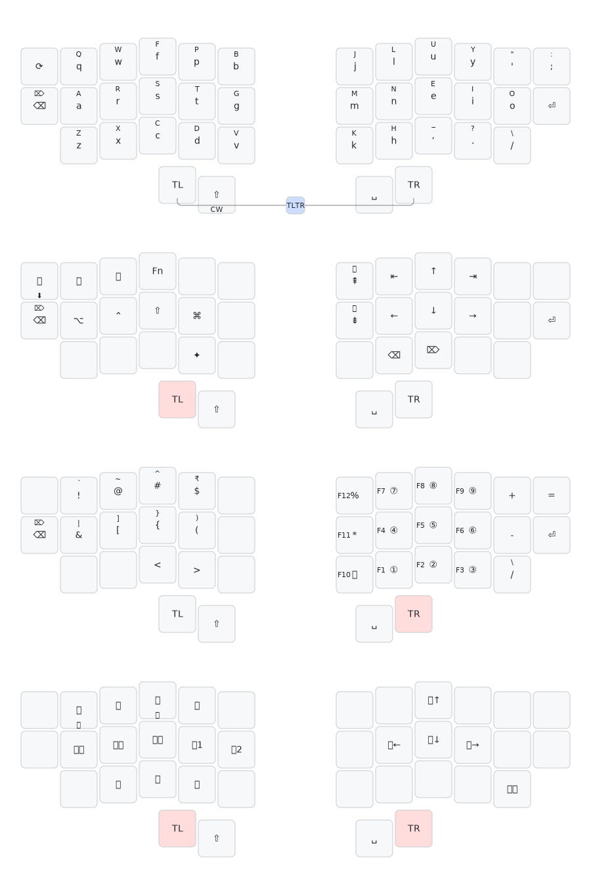
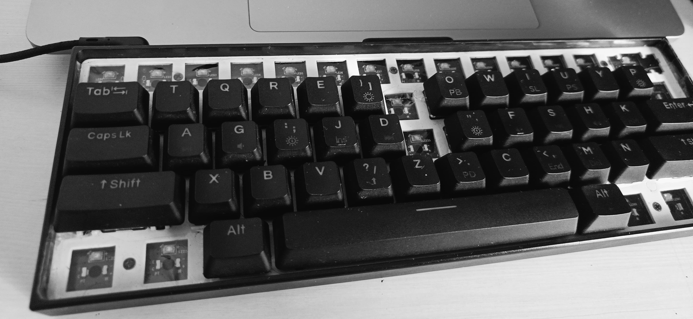
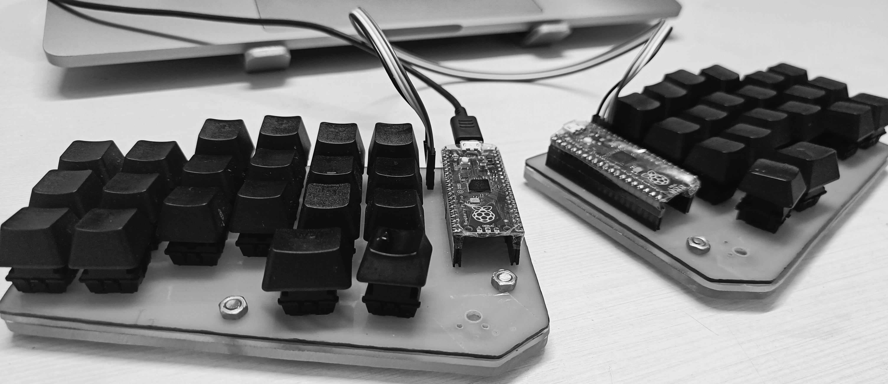

<h1 align='center'>TLTR</h1>

    

---

    

---

A bespoke cross-platform multi-layer 38-key keyboard layout for programmers, i.e., it optimizes for:

1. Minimal mouse/trackpad dependency
2. Convenient numbers & symbols access
3. Execution of complex keyboard shortcuts w/o cumbersome finger gymnastics.
4. Interoperability b/w [ANSI US](https://commons.wikimedia.org/wiki/File:ANSI_Keyboard_Layout_Diagram_with_Form_Factor.svg) & other ergo-split keyboard configurations, viz., [corne](https://github.com/foostan/crkbd/), [cantor](https://github.com/diepala/cantor), [ferris](https://github.com/pierrechevalier83/ferris), etc..

---

| Layers                                                                                        | Functionality                  |
| --------------------------------------------------------------------------------------------- | ------------------------------ |
| [Colemak Mod-DH(Curl), Wide, Angle](https://github.com/ColemakMods/mod-dh?tab=readme-ov-file) | English                        |
| TL                                                                                            | Navigation & Modifiers keys    |
| TR                                                                                            | Numbers & Symbols              |
| TLTR                                                                                          | Mouse, Media & Display control |

    

---

## Can be deployed via:

1. [Kanata](https://github.com/jtroo/kanata/)

   1. macOS
      - Dependencies:
        1. [Karabiner-DriverKit](https://github.com/pqrs-org/Karabiner-DriverKit-VirtualHIDDevice/blob/main/dist/Karabiner-DriverKit-VirtualHIDDevice-3.1.0.pkg)
        2. [Shortcuts](<https://www.wikipedia.com/en/articles/Shortcuts_(Apple)>)
   2. Windows
      - Dependencies:
        1. [nircmd](https://www.nirsoft.net/utils/nircmd.html)
        2. [InterceptionDriver](https://github.com/oblitum/Interception)
   3. \*nix

1. [Karabiner-Elements](https://github.com/pqrs-org/Karabiner-Elements)

   1. macOS

---

## Physical implementation

### Standard row-staggered [ANSI US](https://commons.wikimedia.org/wiki/File:ANSI_Keyboard_Layout_Diagram_with_Form_Factor.svg) 60% keyboard

### Column-staggered ergo-split keyboard, i.e., [Cantor](https://github.com/diepala/cantor)([Piantor](https://github.com/beekeeb/piantor))

---

**Inspired by:** [Seniply](https://github.com/stevep99/seniply)
