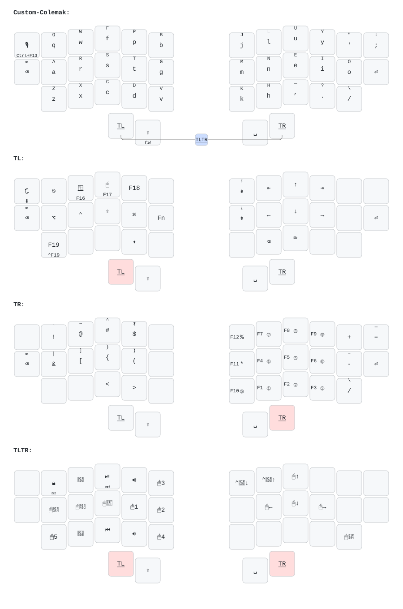
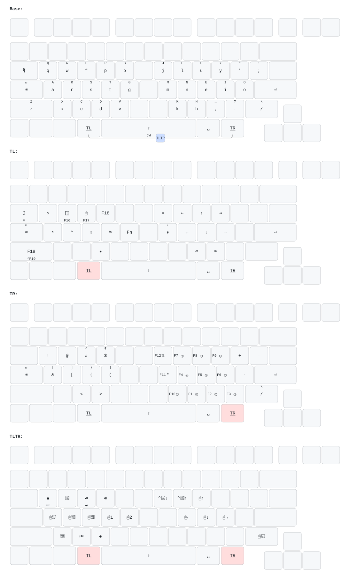
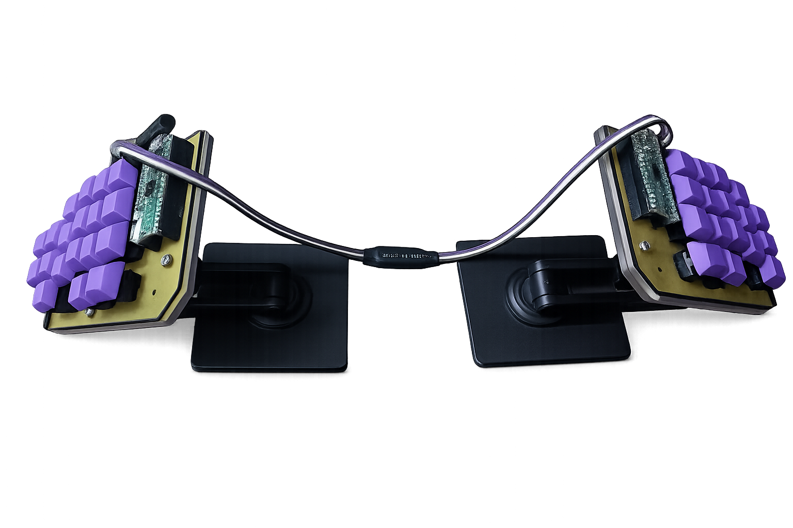
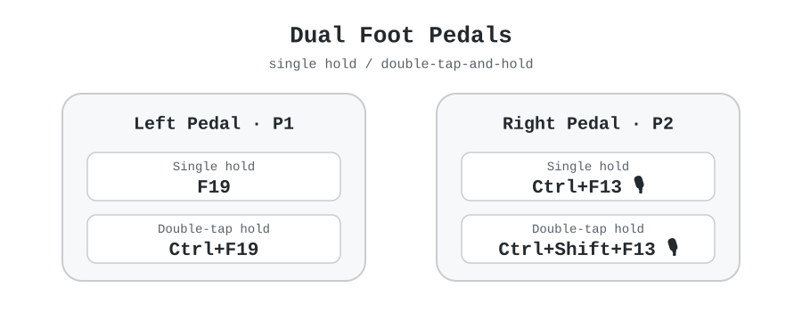

<h1 align='center'>TLTR</h1>

    

---

    
    
    
    
    

---

A bespoke cross-platform multi-layer 38-key keyboard layout for programmers, i.e., it optimizes for:

1. Minimal mouse/trackpad dependency
2. Convenient numbers & symbols access
3. Execution of complex keyboard shortcuts w/o cumbersome finger gymnastics.
4. Interoperability b/w [ANSI US](https://commons.wikimedia.org/wiki/File:ANSI_Keyboard_Layout_Diagram_with_Form_Factor.svg) & other ergo-split keyboard configurations, viz., [corne](https://github.com/foostan/crkbd/), [cantor](https://github.com/diepala/cantor), [ferris](https://github.com/pierrechevalier83/ferris), etc..

---

| Layers                                                                                        | Functionality                  |
| --------------------------------------------------------------------------------------------- | ------------------------------ |
| [Colemak Mod-DH(Curl), Wide, Angle](https://github.com/ColemakMods/mod-dh?tab=readme-ov-file) | English                        |
| TL                                                                                            | Navigation & Modifiers keys    |
| TR                                                                                            | Numbers & Symbols              |
| TLTR                                                                                          | Mouse, Media & Display control |

    <table>
        <tr>
            <th>Split Keyboard Layout</th>
            <th>ANSI Keyboard Layout</th>
        </tr>
        <tr>
            <td>
                
            </td>
            <td>
                
            </td>
        </tr>
    </table>

---

## Can be deployed via:

### Software-based (works with any keyboard):

1. [Kanata](https://github.com/jtroo/kanata/) - Cross-platform key remapper
   1. macOS
      - Dependencies:
        1. [Karabiner-DriverKit](https://github.com/pqrs-org/Karabiner-DriverKit-VirtualHIDDevice)
        2. [Shortcuts](<https://www.wikipedia.com/en/articles/Shortcuts_(Apple)>)
   2. Windows
      - Dependencies:
        1. [InterceptionDriver](https://github.com/oblitum/Interception)
   3. \*nix
      - Dependencies:
        1. `xset` (X11) for the display-off key

### Hardware-based (firmware flashed to keyboard):

2. [QMK Firmware](https://qmk.fm/) - For programmable keyboards
   - Target keyboard: [Piantor](https://github.com/beekeeb/piantor) (RP2040-based Cantor variant)
   - Firmware location: `qmk/piantor_tltr/`
   - Build instructions: See [qmk/README.md](qmk/README.md)

---

## Physical implementation

### Column-staggered ergo-split keyboard, i.e., [Cantor](https://github.com/diepala/cantor)([Piantor](https://github.com/beekeeb/piantor) specifically) with Cherry MX1A Red Switches

---

## Optional: Dual Foot Pedals

Hands-free control via USB or serial foot pedals. Includes both Arduino Uno (serial) and RP2040 (native USB HID) sketches with gesture recognition.

    

See [pedals/README.md](./pedals/) for setup, keymap, and configuration.

---

**Inspired by:** [Seniply](https://github.com/stevep99/seniply)
