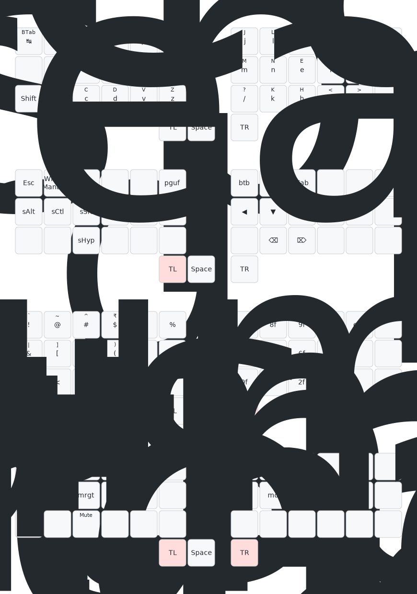

<h1 align='center'> TLTR </h1>

    

Cross-platform multi-layer keyboard layout tailored for programmers, i.e., it optimizes for:
1. Minimal mouse/trackpad dependency
2. Convenient numbers & symbols access
3. Execution of complex keyboard shortcuts w/o cumbersome finger gymnastics.

---

| Layers                                                                                 | Functionality                  |
| ------                                                                                 | -------------                  |
| [Colemak Mod-DH,Wide,Angle](https://github.com/ColemakMods/mod-dh?tab=readme-ov-file)  | English letters & punctuations |
| TL                                                                                     | Navigation & Modifiers keys    |
| TR                                                                                     | Numbers & Symbols              |
| TLTR                                                                                   | Mouse, Media & Display control |
| QWERTY                                                                                 | Backwards Compatibility        |

    

---

## Can be deployed via:
1. [Kanata](https://github.com/jtroo/kanata/)
    1. macOS
        * Dependencies:
            1. [Karabiner-DriverKit](https://github.com/pqrs-org/Karabiner-DriverKit-VirtualHIDDevice/blob/main/dist/Karabiner-DriverKit-VirtualHIDDevice-3.1.0.pkg)
    2. Windows
        * Dependencies:
            1. [nircmd](https://www.nirsoft.net/utils/nircmd.html)
            2. [InterceptionDriver](https://github.com/oblitum/Interception)
    3. *nix

2. [Karabiner-Elements](https://github.com/pqrs-org/Karabiner-Elements)
    1. macOS

---

## Supported & Tested on:
- [ANSI US QWERTY keyboards](https://en.m.wikipedia.org/wiki/File:ANSI_US_QWERTY_(Windows).svg)
- macOS, *nix, & Windows systems

**Inspired by:** [Seniply](https://github.com/stevep99/seniply)